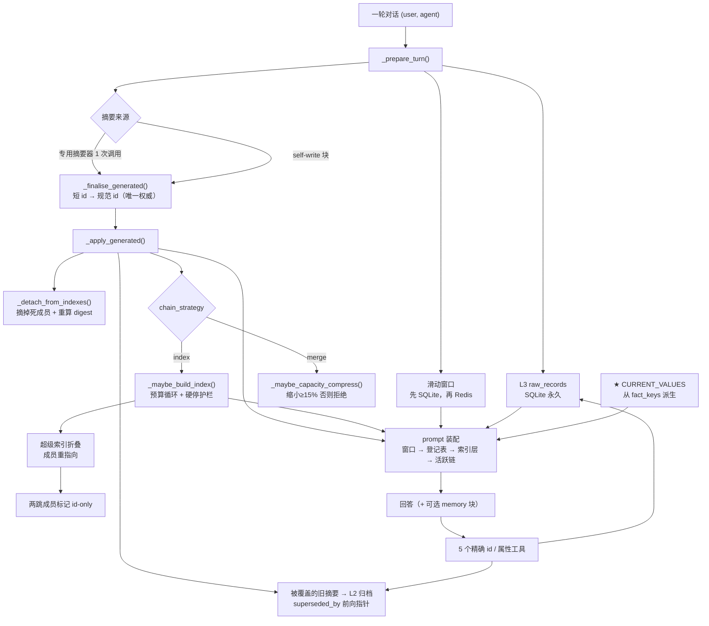

# 当前架构图（审查修复后）

> 对应 commit `165b860`。标 ★ 的是本次审查新增或修正的部分。
> 图按 CJK 宽度感知生成，等宽字体下边框对齐。

---

## 一、总览：一轮对话的写入与读取

```
                              ┌────────────────────────┐
                              │ 一轮对话 (user, agent) │
                              └────────────────────────┘
                                             │
                                             ▼
    写入路径（ingestion）
        ┌──────────────────────────────────────────────────────────────────────────────────┐
        │ _prepare_turn()                                                                  │
        │   ├─ L3 原文  ──▶ raw_records        (SQLite，永久，绝不删除)                    │
        │   └─ 滑动窗口 ──▶ 先写 SQLite 镜像，再更新 Redis 热点        ★顺序修正           │
        │                                                                                  │
        │ 摘要来源（二选一，汇入同一个解析器和同一条落库链路）                             │
        │   ├─ 专用摘要器调用   _generate_only()              (1 次 LLM)                   │
        │   └─ self-write：从回答里剥 <MEMORY_UPDATE> 块       (0 次额外调用)              │
        │        └─ 块缺失 / 不可解析  ⇒  自动回退专用摘要器（只多花一次调用）             │
        │                                                                                  │
        │ _finalise_generated()   短 id(s003) ──▶ 规范 id(ep/s003@ab12cd)     〔唯一权威〕 │
        │                                                                                  │
        │ _apply_generated()      新建 ActiveSummary                                       │
        │   ├─ 被覆盖的旧摘要 ──▶ L2 归档 (is_overridden=True, superseded_by→新 id)        │
        │   └─ _detach_from_indexes()   索引条目摘掉死成员 + 用存活成员重算 digest   ★新增 │
        │                                                                                  │
        │ _after_turn()   ── chain_strategy ──┬─ index ─▶ _maybe_build_index()             │
        │                                     └─ merge ─▶ _maybe_capacity_compress()       │
        └──────────────────────────────────────────────────────────────────────────────────┘
                                             │
                                             ▼
    读取路径（prompt 装配：顺序固定）
        ┌───────────────────────────────────────────────────────────────────────┐
        │ system : 回答契约 + 工具说明(仅 supports_tools 时) + self-write 指令  │
        │ user   : ① <RECENT_RAW_DIALOGUE>    最近 K=4 轮逐字（L3 的窗口视图）  │
        │          ② <CURRENT_VALUES>        ★新：槽位=最新值（派生，永不过期） │
        │          ③ <INDEX_LAYER>           目录标题   digest ｜ theme         │
        │          ④ <ACTIVE_SUMMARY_CHAIN>  未收纳摘要（含 OVERRIDES / FACTS） │
        │          ⑤ <QUESTION>                                                 │
        └───────────────────────────────────────────────────────────────────────┘
```

---

## 二、摘要的三种状态（渲染契约）

```
                          活跃摘要 ActiveSummary（在链上，永不删除）
                                        │
          ┌─────────────────────────────┼─────────────────────────────┐
          │                             │                             │
          ▼                             ▼                             ▼
      ① 未收纳                     ② 一跳（挂标题下）            ③ 两跳（被折叠）
      index_id == ""                index_id == idx…             index_id == LAZY  ★
        直接渲染在链上                 只渲染 IndexEntry 的标题       只渲染超级索引的标题
        （ACTIVE_SUMMARY_CHAIN）       成员不再逐条渲染              成员不再逐条渲染
          │                             │                             │
          └─────────────────────────────┴─────────────────────────────┘
                                        │
                                        ▼
            expand_index · get_archived_summary · get_raw_record
            按 id 精确取回 —— 三层都可达

  不变量：凡是不渲染的摘要，必须有指针指向它（某个 live 标题的 members）。
  ★ 修正：「把未归档摘要转成 id-only」这条分支已删除——那种摘要没有任何指针，
          藏起来就是真的不可达（这正是原先潜伏的 bug）。
```

---

## 三、两套压缩机制（指标可分别归因）

```
  触发条件                        动作                               指标                     OVERRIDES 标签
  ───────────────────────────────────────────────────────────────────────────────────────────────────────────
  事件式覆盖                      旧摘要 → L2 归档                    overrides_events         ✅ 必须
  （同属性、新值 ≠ 旧值）         新摘要留在链上并列出被覆盖 id       overridden_summaries
                                  ★ 同步更新索引条目

  容量压力                        ① index 策略：最老一组 → 标题        capacity_compressions    ❌ 禁止
  （渲染 token > 预算）           ② merge 策略：多条 → LLM 合并        indexes_built
                                  合并后必须缩小 ≥15%，否则拒绝         capacity_merges_rejected

  ⚠ 两者并非互斥：同一轮可以既发生覆盖、又归档其他摘要以压回预算（各自独立计数）。
    早期文档声称的「覆盖当轮不再压缩」护栏代码里从未存在，已改为如实描述。

  index 策略的预算循环 _maybe_build_index()：一个循环 + 全部无条件硬停
    ├─ 先关预览（最省的一步）；★ 现在有滞回：回到 70% 预算以内会重新打开
    ├─ 每轮最多 3 × INDEX_MAX_PER_TURN 次操作          （防跑飞：曾产出 800 条目 / 11k token 的 prompt）
    ├─ 严格进度三元组：token 必须下降 + 摘要数必须下降   （否则停手，而不是继续堆）
    ├─ 代价闸门：entry 成本 ≥ 被替换成本 ⇒ 拒绝          （index_rejections）
    └─ 超级索引折叠：标题的标题；组数由 child_index_ids 渲染   ★不再把 [N 组] 写进标题
       折叠后成员必须重指向超级索引                     （否则成员重新渲染、成本反弹）
```

---

## 四、存储层

```
    ┌───────────────────────────────────────────────────────────────────────────────┐
    │ SQLite（冷层）＝ 真相来源     7 张表 + 1 张评测附加表                         │
    │   raw_records          原文，永久，绝不删除                                   │
    │   archived_summaries   L2 归档，永久（superseded_by 前向指针）                │
    │   active_summaries     L1 镜像（崩溃恢复用）                                  │
    │   index_entries        目录条目   ★新增 theme / previews / child_index_ids 列 │
    │   sliding_window       窗口镜像（崩溃恢复用）                                 │
    │   episode_progress     批实验断点（run_id::system, scoped episode）           │
    │   experiment_runs      每个 (run, system, episode) 的结果行 + payload         │
    │   episode_events       评测层附加事件表（evaluation.py 建）                   │
    └───────────────────────────────────────────────────────────────────────────────┘
                                            │
                                            │   所有写：先 SQLite，成功后再动 Redis
                                            │   ★修正：append_window_record 此前是唯一的 Redis-first
                                            ▼
    ┌──────────────────────────────────────────────────────────────────────────┐
    │ Redis 热点（纯缓存，可随时丢）                                           │
    │   episode:{episode_id}:active_ids   LIST  摘要 id 顺序                   │
    │   episode:{episode_id}:active       HASH  id → JSON(ActiveSummary)       │
    │   episode:{episode_id}:window       LIST  JSON(RawDialogRecord)          │
    │   episode:{episode_id}:index_ids    LIST  目录 id 顺序（渲染出来的标题） │
    │   episode:{episode_id}:index        HASH  id → JSON(IndexEntry)          │
    │   episode:{episode_id}:meta         HASH  轮次簿记                       │
    │   RedisUnavailable ⇒ 自动降级走 SQLite，并从镜像重建热点                 │
    │   ★修正：9 处 pipeline 写此前未包装异常，掉线会直接崩掉 episode          │
    └──────────────────────────────────────────────────────────────────────────┘

  reset(episode_id)            清热点 + 清镜像；保留 L2 归档与 L3 原文
  clear_archive(episode_id)   ★新：批实验每个 episode 开始时清归档（绝不动原文）
                                —— 命名空间 system/episode 不含 run id，否则跨 run 污染
  purge(episode_id)            连归档与原文一起删（只在可视化「新会话」用）
```

---

## 五、检索：只有精确 id / 属性，没有向量

```
  5 个工具，全部是精确 id / 精确属性匹配——没有向量、没有 embedding、没有相似度排序：

   get_archived_summary(summary_id)          按 id 取归档；沿 superseded_by 前向回溯，
                                             "现在被谁取代、当前值是什么" 一并返回；
                                             id 其实在层 1 时也能命中（渲染 / 收纳 / 两跳三态）
   get_raw_record(reference_id)              按 id 懒加载完整原文
   get_predecessor_summary(fact_key,         按属性名 + 锚点值精确回溯：先定位记录锚点的摘要，
                           reference_value)  再返回被它直接取代的旧值（拿到紧邻前驱）
   expand_index(index_id)                    展开目录条目 → 它指向的全部摘要
   list_active_summaries()                   调试用

   ★ 修正：别名归一化改为按工具解析——"reference" 对 raw 工具是 reference_id，
     对 predecessor 是 reference_value；"id" 对归档工具是 summary_id、对 raw 工具是 reference_id。
     此前扁平别名表把锚点丢进 reference_id，历史查询退化成"取最新旧值"。
   ★ 修正：解析前 NFKC 归一化（全角 （）：＝ 也能解析）；接入 strip_tool_echoes
     （模型引用 [TOOL RESULT] 行不会被重复执行）。
   ★ 不变量：答案里绝不能出现工具调用字符串。迭代上限 / 无工具系统 / 强制重答
     三种情形都会消毒，并记为 tool_call_as_answer。
```

---

## 六、评测轨道

```
  dataset ──▶ 每个 system 独立命名空间  system/episode
               │
               ├─ three_layer    本方案（5 个工具 / 三层 / OVERRIDES）
               ├─ full_context   全部原文进 prompt（超预算从最老开始截断）
               ├─ memgpt_style   滚动摘要 + 破坏性删除原文（无工具、无归档）
               └─ naive_chain    只追加摘要链、丢最老（无工具、无归档、无 OVERRIDES）

   统一的答案契约与工具循环（base_agent）；无 executor 的系统收到**中立提示**
   ★ 修正：此前两个基线被灌输了它们没有的工具手册与"必须先调用工具"，
     模型输出工具调用 → 无法执行 → 该字符串直接成为它的答案并被判错。

   每 episode：ingestion → 探针（Current / History / MemoryPoint）→
              判分（严格 string → LLM 裁判）→
              predictions.csv / metrics.csv / probe_predictions.csv / episode_logs.jsonl
   ★ 修正：resume 会回填已完成的 episode（此前指标只剩本次进程的子集，且 CSV 被截断）
   ★ 修正：多系统 predictions.csv 不再累积重复（曾 4 系统 × n → 10n 行）
```

---

## 七、token 构成

```
   链正文（渲染出的摘要正文）                     ← Avg_Active_Chain_Tokens（严格上报口径）
 + 索引标题 digest ｜ theme
 = 记忆链 token                                   ← active_chain_text_tokens
 + 滑动窗口 + 登记表 + 行渲染开销
 = 同口径上下文成本                               ← Avg_Active_Chain_Tokens_rendered（四系统可比）

   ★ 预算触发用的是"渲染口径"（含登记表与索引标题），所以"归档必须让成本真的下降"才有意义。
   ★ 登记表成本单独记：current_values_tokens / avg_current_values_tokens。
   ★ 修正：四个系统的 Avg_Active_Chain_Tokens 现在统一为"实际渲染量的每轮均值"
     （此前是每轮均值 / 终态总量 / 未截断存储量三者混用）。
```

---

## 八、Mermaid 版本（便于导出 / 渲染）


